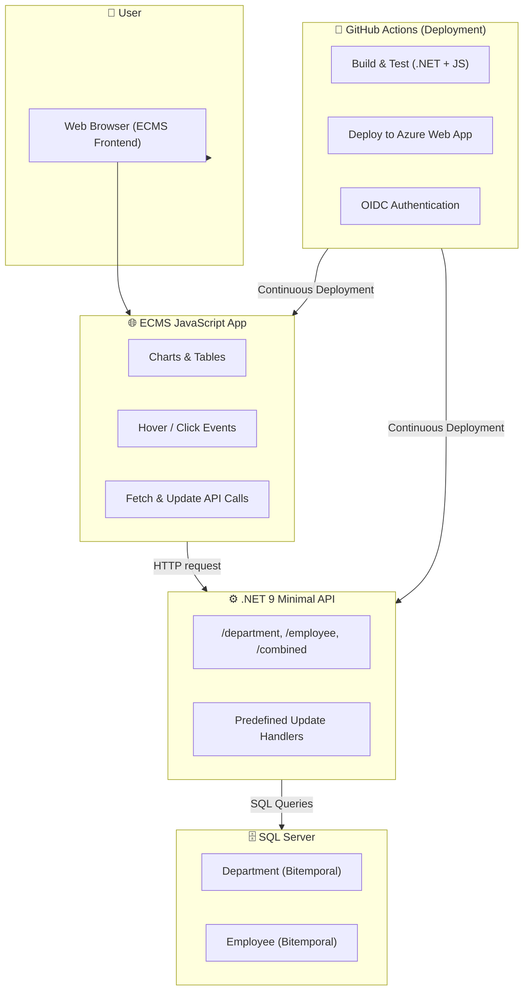

# 🕓 Bitemporal App

The **Bitemporal App** is an interactive web application demonstrating **bitemporal data management** using the classic `Department` and `Employee` entities.
It visualizes how data evolves across both **valid time** and **transaction time**, allowing exploration of historical consistency, corrections, and effective records.

---

## 🚀 Overview

The app provides:

* **Bitemporal charts** for `Department 10` and `Employee 100`
* **Interactive data tables** showing underlying bitemporal records
* **Dynamic highlighting** — hover over a chart intersection to highlight corresponding records
* **Contextual queries** — click a point to run a combined Department/Employee query effective at that time
* **Predefined updates** — simulate updates and instantly visualize the new temporal state

---

## 🧩 Architecture

| Layer          | Technology                                     | Description                                           |
| -------------- | ---------------------------------------------- | ----------------------------------------------------- |
| **Frontend**   | ECMS JavaScript Web App *(Visual Studio Code)* | Interactive charts, tables, and event-driven UI       |
| **Backend**    | .NET 9 Minimal APIs *(Visual Studio 2026)*     | Serves temporal data, queries, and update endpoints   |
| **Database**   | SQL Server                                     | Stores bitemporal `Department` and `Employee` records |
| **Deployment** | Azure Web App (CI/CD via GitHub Actions)       | OIDC-secured, secret-less deployment pipeline         |

---

### 🗺️ System Architecture Diagram



---

## 🧠 Bitemporal Concepts

The application demonstrates two key time dimensions:

* **Valid Time** → When a fact is true in the *real world*
* **Transaction Time** → When the fact is recorded or modified in the *database*

This dual-timeline approach enables:

* Historical and system-level auditing
* Retroactive and correctional updates
* Querying effective states at any given time

---

## 💡 Application Features

### 1. Department and Employee Charts

* Department 10 and Employee 100 visualized over valid and transaction time
* Hovering highlights effective records in the data tables

### 2. Underlying Data Tables

* List all bitemporal records for each entity
* Real-time highlighting of effective rows

### 3. Combined Query on Click

* Displays results of Department–Employee join at the clicked valid/transaction intersection

### 4. Predefined Updates

* Simulate corrections or retroactive changes
* Observe changes reflected across charts and tables immediately

---

## ⚙️ Getting Started

### Prerequisites

* [.NET 9 SDK](https://dotnet.microsoft.com/)
* [SQL Server](https://www.microsoft.com/sql-server/)
* [Node.js](https://nodejs.org/)
* [Visual Studio 2026](https://visualstudio.microsoft.com/) or [VS Code](https://code.visualstudio.com/)

### 1. Clone the repository

```bash
git clone https://github.com/brittonp/Bitemporal
cd bitemporal
```

### 2. Configure the backend

Edit `appsettings.json`:

```json
"ConnectionStrings": {
  "BitemporalDb": "Server=localhost;Database=BitemporalDB;Trusted_Connection=True;"
}
```

### 3. Run the backend

The backend uses HTTPS, so you may need to trust the local dev certificate:

```bash
dotnet dev-certs https --trust
```

Run the API:

```bash
dotnet run --project api/Bitemporal-api.csproj --urls "https://localhost:7115"
```

### 4. Run the frontend

```bash
cd web
npm install
npm start
```

### 5. View the app

Open [http://localhost:3000](http://localhost:3000)

---

## 🧱 Project Structure

```
bitemporal-app/
│
├── api/                         # .NET 9 Minimal API backend
│
├── web/                         # ECMS JavaScript frontend
│
├── sql/                         # Database scripts (schema & seed data)
│
└── .github/workflows/           # CI/CD (Azure deployment)
```

---

## 🧩 Bitemporal Query Example

A core feature of the Bitemporal App is retrieving the **effective record** for a given **valid time** and **transaction time**.

### 🧮 SQL Server Example

Combined Department–Employee query:

```sql
DECLARE @ValidTime DATETIME2 = '2024-06-01T00:00:00';
DECLARE @TransactionTime DATETIME2 = '2024-07-01T00:00:00';

WITH 
	as_of_employee 
AS
(
	SELECT 
		*
	FROM 
		btd.employee
	WHERE 
		@ValidTime >= valid_from
	AND 
		@ValidTime < valid_to
	AND 
		@TransactionTime >= tran_from
	AND 
		@TransactionTime < tran_to
),
	as_of_department 
AS
(
	SELECT 
		*
	FROM 
		btd.department
	WHERE 
		@ValidTime >= valid_from
	AND 
		@ValidTime < valid_to
	AND 
		@TransactionTime >= tran_from
	AND 
		@TransactionTime < tran_to
)
-- ============================================================
-- Join filtered tables
-- ============================================================
SELECT
	@tran_date AS tran_date, 
	@valid_date AS valid_date,
	d.dept_hist_id,
	d.dept_name,
	e.emp_hist_id,
	e.emp_id,
	e.first_name,
	e.last_name,
	e.job_title,
	e.hire_date,
	e.term_date
FROM 
	as_of_department d
LEFT JOIN
	as_of_employee e
ON 
	e.dept_id = d.dept_id
WHERE 
	d.dept_id = 10
ORDER BY 
	d.dept_hist_id,
	e.emp_hist_id
;
```
---

## ☁️ Deployment

* CI/CD via **GitHub Actions**
* Builds the .NET API and ECMS web app
* Deploys both to **Azure Web App**
* Uses **OpenID Connect (OIDC)** for secure, secret-less authentication

---

## 📜 License

This project is licensed under the **MIT License** — see the [LICENSE](LICENSE) file for details.

---

## 👥 Authors / Contributors

* **[Your Name]** — Developer & Maintainer
* Contributions are welcome via issues and pull reque
